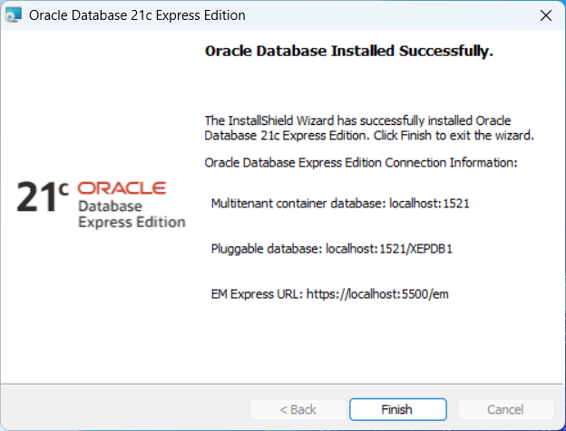
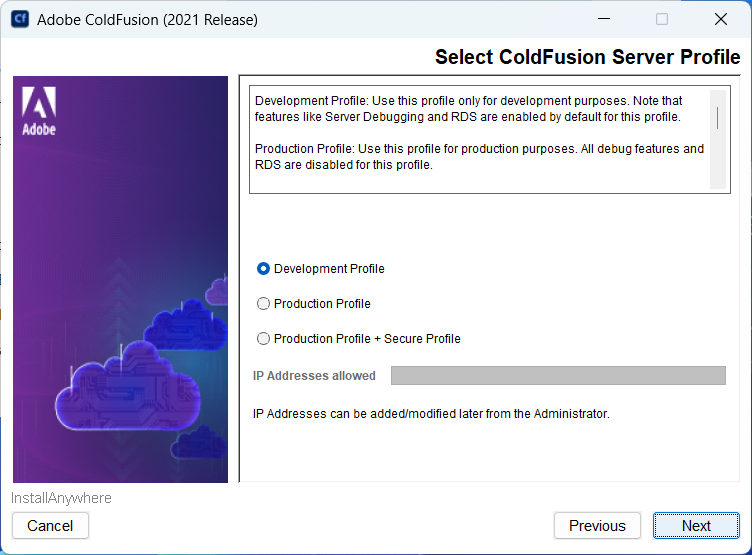
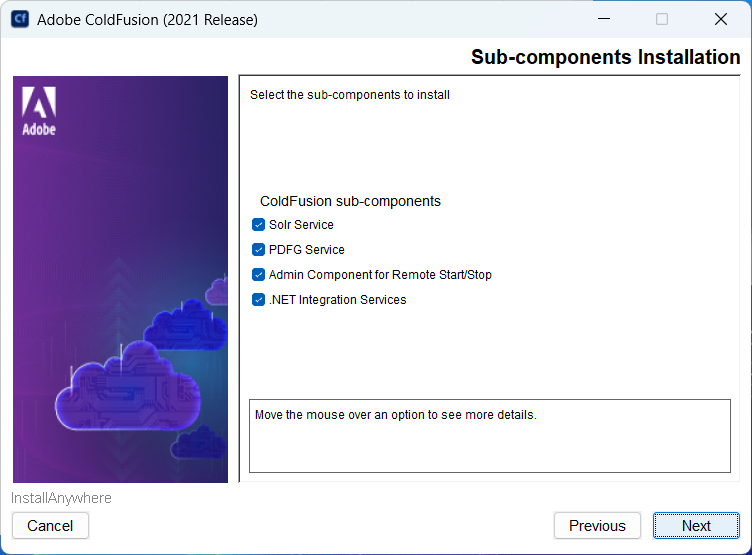
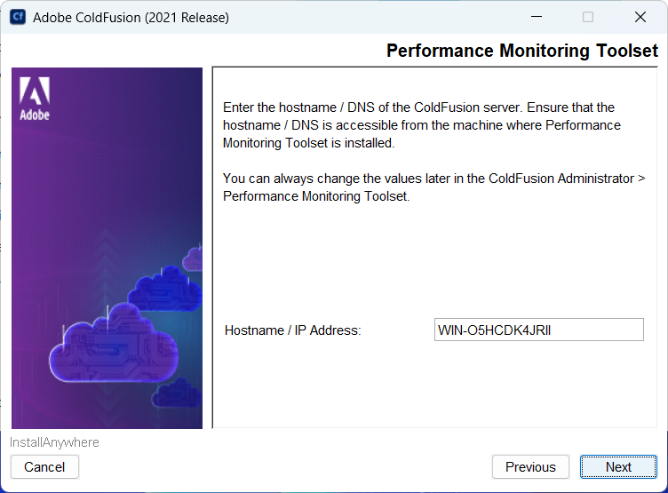
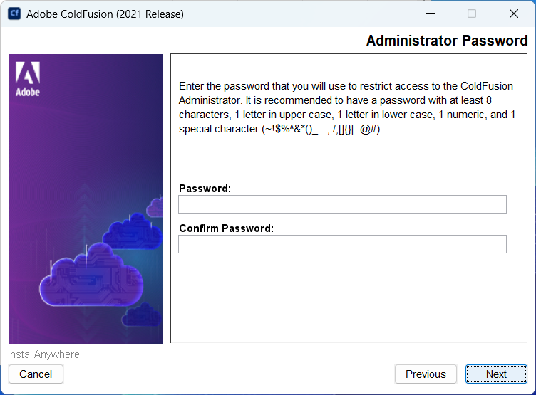
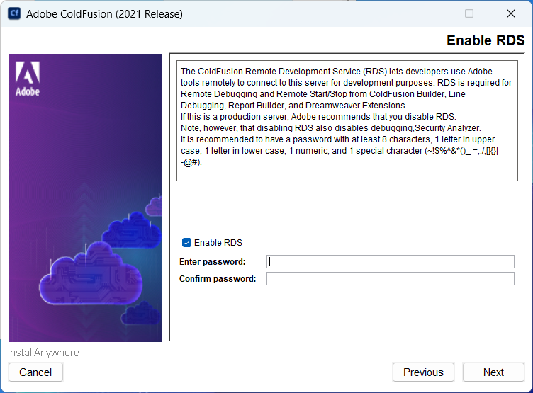
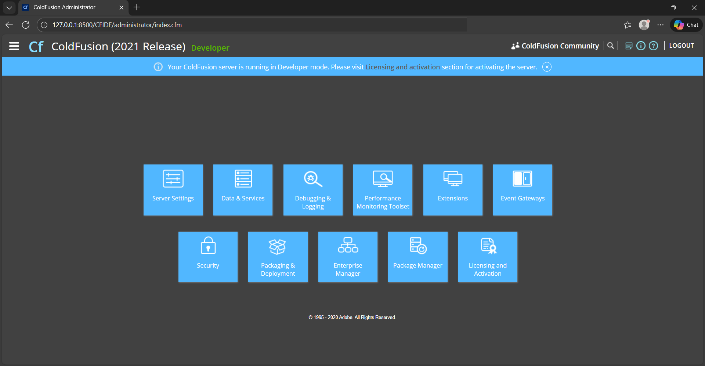

# Day 1 — Foundations: ColdFusion, the Existing App & Planning with AI

> *Part of **MCP Development for Web Applications** — AI-driven development with ColdFusion, Oracle
> and Node.js (Day 1 of 3).*

**The course in one line:** a school already has a **student records** web app (ColdFusion + Oracle,
table `murid`). In three days you give it a **REST API**, then an **MCP server**, so an AI assistant
can run the app in plain English — *"Who is in Form 4?"*, *"Add a new student…"*.

**The one rule:** the AI writes the code. **You** decide what "done" means, and **you** run every test.

**Today you will**
- install the tools and check they work
- change small ColdFusion pages and see the result
- read the database from a ColdFusion page
- use the existing student app
- set up the AI in VS Code
- let the AI interview you and write the plan for your REST API

**Not today:** building the API (Day 2), MCP (Day 2 afternoon), Postman and Node.js (Day 2), Claude
Desktop (Day 3).

> **Do Topic 1 at home, before the course.** The downloads are big (Oracle 2 GB, ColdFusion 1.2 GB)
> and Oracle alone takes 15–30 minutes to install. Day 1 starts by checking Topic 1 together.

---

## Before you start

**Your cheat sheet** — every value you type today:

| What | Value |
|---|---|
| Oracle password | the one **you** choose in 1.1 — write it down |
| ColdFusion Administrator password | `KPM@2026` |
| Database user / password | `cfapp` / `cfapp123` |
| Database address | host `localhost` · port `1521` · service name `XEPDB1` |
| Datasource name | `cf_test_crud` |
| Course folder | `C:\ColdFusion2021\cfusion\wwwroot\kpm-mcp-coldfusion` |
| Course in the browser | `http://localhost:8500/kpm-mcp-coldfusion/` |

**The windows you use**

| The notes say | You do |
|---|---|
| **File Explorer** | the yellow folder icon on the taskbar |
| **Browser** | Chrome or Edge |
| **VS Code** | the code editor (installed in 1.7) |
| **Services** | Start → type `Services` → open it. Starts and restarts Oracle and ColdFusion |
| **Command Prompt** | Start → type `cmd` → **Enter**. Used only twice today (1.4 and 7.1) |

**To run a command:** copy the grey box → click inside Command Prompt → **Ctrl+V** (or right-click) to paste → **Enter**.

**You need:** Windows 10/11 64-bit, **admin rights**, **8 GB RAM** (16 GB is better), **20 GB free
disk**, and no other Oracle database installed.

---

## Topic 1 — Install and check your tools

Do the steps **in order**.

### 1.1 — Install Oracle XE (the database)

1. **Browser** — download (2 GB, no Oracle account needed):
   `https://download.oracle.com/otn-pub/otn_software/db-express/OracleXE213_Win64.zip`
2. Unzip it. Right-click **`setup.exe`** → **Run as administrator**.
3. Go through the screens:
   - **License** → Accept
   - **Destination folder** → type **`C:\oraclexe\`** (the default breaks if your Windows user name has
     a space)
   - **Password** → choose one, **letters and numbers only** → write it down
   - **Summary** → Install
4. Wait **15–30 minutes**. The last screen says **Oracle Database Installed Successfully**:

   

5. Click **Finish**. Oracle now starts by itself every time Windows starts.

**What the screen means.** Think of Oracle as a building, and `XEPDB1` as your apartment in it:

| Line on the screen | In plain words | Do you use it? |
|---|---|---|
| `localhost:1521` | Oracle itself, on this laptop (`1521` is its door number) | no |
| `localhost:1521/XEPDB1` | the database where the course tables live | **yes** — in 1.4, 1.5 and 1.6 |
| `https://localhost:5500/em` | Oracle's own web control panel | no — DBeaver does this job |

### 1.2 — Install ColdFusion 2021 (the web server)

1. **Browser** — download (1.2 GB):
   `https://cfdownload.adobe.com/pub/adobe/coldfusion/2021/cfinstaller/cf2021u5/ColdFusion_2021_GUI_WWEJ_win64.exe`
2. Right-click the file → **Run as administrator**. Go through the screens in this order:
   - **Serial number** → leave it **blank** (free Developer Edition)
   - **Installer configuration** → **Server configuration**
   - **Server Profile** → **Development Profile**, leave the IP box empty → Next

     

   - **Sub-components** → **untick all four** → Next

     

   - **Packages** (only if this screen appears) → tick **`oracle`**
   - **Install folder** → keep `C:\ColdFusion2021`
   - **Web server** → **Built-in web server**, port **8500**
   - **Performance Monitoring Toolset** → change nothing → Next

     

   - **Administrator Password** → **`KPM@2026`** in both boxes → Next

     

   - **Enable RDS** → **untick** it (the boxes turn grey) → Next

     

   - Finish the installer.

   > **Windows Firewall asks about ColdFusion or Java?** Click **Cancel**. Everything runs on your
   > laptop only — and it stops classmates from opening your Administrator.

3. **Browser** — open `http://localhost:8500/CFIDE/administrator/` → password **`KPM@2026`** → Login.
   You see the **ColdFusion Administrator**, the control panel for the server:

   

   You only use **three** tiles: **Package Manager** (next step), **Debugging & Logging** (step 5)
   and **Data & Services** (1.6). Ignore the others. Close the blue *"Developer mode"* banner with
   **×** — do **not** activate anything.

4. **Install the Oracle driver:** **Package Manager** → **Packages** → find **oracle** → **Install**.
   Already under *Installed packages*? Nothing to do.

5. **Turn off debug output:** **Debugging & Logging** → **Debug Output Settings** → untick **Enable
   Request Debugging Output** → **Submit Changes**.

   > **Why?** Otherwise ColdFusion adds a block of debug HTML to the end of every page. On Day 2
   > that breaks the API's JSON answers.

6. **Restart ColdFusion:** Start → type `Services` → open it (click **Yes** if Windows asks). Find
   **ColdFusion 2021 Application Server** → right-click → **Restart**. You use this same window
   whenever the notes say "start" or "restart" a service.

### 1.3 — Get the course files

1. **Let your account save files in ColdFusion's web folder** (otherwise VS Code says "Access denied"
   later):
   - **File Explorer** → go to `C:\ColdFusion2021\cfusion`.
   - Right-click the **`wwwroot`** folder → **Properties** → **Security** tab → **Edit…**
   - Click **Users** in the list. (Not there? **Add…** → type `Users` → **OK**.)
   - In the **Allow** column, tick **Modify** → **OK** → **OK**.
2. **Browser** — open `https://github.com/luqmanyusof/kpm-mcp-coldfusion` → green **Code** button →
   **Download ZIP**.
3. **File Explorer** — double-click the downloaded ZIP. Inside is one folder,
   `kpm-mcp-coldfusion-main`. Drag it into `C:\ColdFusion2021\cfusion\wwwroot`.
4. Rename that folder to **`kpm-mcp-coldfusion`** (right-click → **Rename**). The name must be exactly
   this — every link in these notes uses it.

From now on, **"the course folder"** means `C:\ColdFusion2021\cfusion\wwwroot\kpm-mcp-coldfusion`.

### 1.4 — Create the database user and tables

This is the one install step that needs typed commands — Oracle's setup scripts only run in its own
tool, `sqlplus`.

1. **File Explorer** — open the course folder → **`code`** → **`db`**. Click the address bar at the top, type
   `cmd`, press **Enter**. A Command Prompt window opens, already in the `db` folder.
2. Create the course user — paste this, press **Enter**:

   ```
   sqlplus "sys@//localhost:1521/XEPDB1" as sysdba "@create_user.sql"
   ```

   It asks for a password: type **your Oracle password from 1.1** (nothing shows while you type) →
   Enter. You see: `user cfapp ready`.

3. Create the tables and sample data — paste, **Enter**:

   ```
   sqlplus -s "cfapp/cfapp123@//localhost:1521/XEPDB1" "@schema.sql"
   ```

   The last lines say: `pelajar rows: 5` and `murid rows: 6`.

> **Data got messy later in the course?** Do steps 1 and 3 again. It resets both tables.

### 1.5 — Install DBeaver (to look inside the database)

You use DBeaver all course to check what the app, and later the AI, **really** changed.

1. **Browser** — download DBeaver Community (free) from
   `https://dbeaver.io/files/dbeaver-ce-latest-windows-x86_64.exe`. Install with the defaults.
2. In DBeaver: **Database → New Database Connection → Oracle → Next**. On the **Main** tab fill in:

   | Field | Value |
   |---|---|
   | Host | `localhost` |
   | Port | `1521` |
   | Database | `XEPDB1` — and pick **Service Name** (not SID) |
   | Authentication | Oracle Database Native |
   | Username / Password | `cfapp` / `cfapp123` — tick **Save password** |

3. Click **Test Connection**. The first time it offers to download the Oracle driver → **Download**.
   You see **Connected** → **Finish**.

### 1.6 — Connect ColdFusion to the database (the datasource)

A **datasource** is a named database connection, saved once in ColdFusion. Pages then only say
`datasource="cf_test_crud"`, so the database password is never in the code.

1. **Browser** — ColdFusion Administrator → **Data & Services → Data Sources**.
2. Data Source Name: `cf_test_crud` · Driver: **Oracle** → **Add**.
3. Fill in:

   | Field | Value |
   |---|---|
   | SID Name / Service Name | `XEPDB1` (pick "Service Name" if there is a choice) |
   | Server | `localhost` |
   | Port | `1521` |
   | User name / Password | `cfapp` / `cfapp123` |

4. **Submit.** The list shows `cf_test_crud` with status **OK**.

> **Error about SID or listener?** Edit the datasource → clear the SID field → **Show Advanced
> Settings** → type `ServiceName=XEPDB1` in **Connection String** → Submit.

### 1.7 — Install VS Code (the code editor)

1. **Browser** — download from `https://code.visualstudio.com/` and install. On the "Select
   Additional Tasks" screen, tick **"Open with Code"**.
2. In VS Code: **File → Open Folder…** → choose the course folder.

**Checkpoint ✅ (Topic 1 complete)**

| Check | You should see |
|---|---|
| **Services** window (Start → `Services`) | `OracleServiceXE` and `Oracle…TNSListener`: **Running** |
| **DBeaver:** CFAPP → Tables → MURID → **Data** tab | **6** students |
| **Browser:** `http://localhost:8500/kpm-mcp-coldfusion/code/basics/03-database.cfm` | a table of **5** rows |
| **Browser:** `http://localhost:8500/kpm-mcp-coldfusion/code/crud/` | a list of **6** students |

**Common problems**

| You see | Do this |
|---|---|
| Oracle installer fails half way | Uninstall it (Settings → Apps), restart Windows, install again to `C:\oraclexe\` as administrator |
| `sqlplus` is not recognised | Restart Windows, then redo 1.4. Still missing? Type `C:\oraclexe\dbhomeXE\bin\sqlplus.exe` instead of `sqlplus` |
| sqlplus prints a long help page (`Usage 1: sqlplus -H \| -V`) | The command was mistyped. Copy it again exactly — with the **double** quotes |
| `ORA-12541: no listener` | Windows **Services** → start the `Oracle…TNSListener` service |
| `ORA-12514: listener does not currently know of service` | Oracle is still starting. Wait 2 minutes. Still failing? Restart `OracleServiceXE` |
| `ORA-01017: invalid username/password` | Step 1.4-2 needs **your** Oracle password. Everything else is `cfapp` / `cfapp123` |
| `ORA-00942: table or view does not exist` | You skipped step 1.4-3 |
| DBeaver cannot download the driver | A company network blocks it. Ask the trainer for the USB copy |
| `Datasource cf_test_crud could not be found` | Redo 1.6. Check the spelling |
| `localhost:8500` does not open | Windows **Services** → start **ColdFusion 2021 Application Server** |
| `404` on a course page | The folder is not called `kpm-mcp-coldfusion`, or is not inside `wwwroot` |
| "Access denied" when copying into `wwwroot` or saving in VS Code | Redo step 1.3-1 (tick **Modify** for **Users**) |

---

## Topic 2 — What MCP is, and how this course works (concept)

**Read this while the class finishes Topic 1.** Full version: [mcp-theory.md](mcp-theory.md), parts 1–3.

- **Web apps are built for people** — log in, click, fill forms.
- An **MCP server** gives an AI assistant its own entrance — a **"staff entrance"** next to the front
  door for humans.
- The AI can then use the app when you ask in plain English. The app still keeps the data and the
  rules.

**What you will have by Day 3:**

```
 You, in plain English
        |
 Claude Desktop ---- MCP ----> MCP server (Node.js)       <- Day 2 PM - Day 3, built by the AI
                                    |  HTTP + key
                                    v
 Web pages (crud/) ----------> REST API (ColdFusion)      <- Day 2 AM, built by the AI
        |                           |
        +---------> Oracle (murid table) <-------+        <- today
```

**Who does what**

| You | The AI |
|---|---|
| install and run the tools | reads the existing code |
| answer its questions, approve the plan | writes the plan (`REQUIREMENTS.md`, `PHASES.md`) |
| run every test, report what you saw | writes and fixes the code, one small step at a time |
| decide when something is "done" | never marks its own work as tested |

**Checkpoint ✅** In one sentence each: what is an MCP server for, and why doesn't the AI decide when
a step is finished?

---

## Topic 3 — Your first ColdFusion code

**Goal:** change a page, save, refresh, see the change. That is how you work in ColdFusion.

**How it works:** a `.cfm` file is an HTML page plus tags that start with `cf`. ColdFusion runs the
`cf` tags and sends plain HTML to the browser.

**Set up your screen** — put the two side by side:
- **VS Code:** left panel → `code` → `basics` → open `01-syntax.cfm`.
- **Browser:** `http://localhost:8500/kpm-mcp-coldfusion/code/basics/01-syntax.cfm`

> Each lesson page shows its code twice: once as text for you to read (lines with `&lt;`), and once as
> real code. **Always edit the real one** — the line numbers below point to it.

### 3.1 — Variables (`01-syntax.cfm`)

| Code | What it does |
|---|---|
| `<cfset name = "Ahmad Danish">` | stores a value. Shows nothing. |
| `<cfoutput>Name: #name#</cfoutput>` | prints it. `#name#` means "the value of `name`". |

**Try it**
1. **VS Code**, line 24: change `"Ahmad Danish"` to your own name. Save (**Ctrl+S**).
2. **Browser:** press **F5**. The *Output* line and the *Uppercase* line show your name.
3. **Break it on purpose.** Line 27: delete `<cfoutput>` and `</cfoutput>`. Save, **F5**. The page
   now shows `#name#` as plain text — the most common beginner mistake.
4. Put them back (**Ctrl+Z**), save, **F5**.

### 3.2 — Decisions, loops and lists (`02-logic.cfm`)

Open `code/basics/02-logic.cfm` in VS Code, and `…/basics/02-logic.cfm` in the browser.

| Code | What it does |
|---|---|
| `<cfif markah GTE 80>A<cfelseif markah GTE 60>B<cfelse>C</cfif>` | chooses. Compare with words: `EQ NEQ GT LT GTE LTE` |
| `<cfloop index="i" from="1" to="5"> … </cfloop>` | repeats |
| `["Bestari","Cerdik","Amanah"]` | an **array** (a list). The first item is `[1]`, not `[0]` |
| `{ name="Nur Aisyah", email="…" }` | a **struct** — named values, like **one database row** |

**Try it** (save and **F5** after each change)
1. Line 19: change `markah = 75` to `markah = 85`. The output changes from **B** to **A**.
2. Line 29: change `to="5"` to `to="10"`. The loop now prints 1 to 10.
3. Line 37: add `,"Dinamik"` after `"Amanah"`. The total changes to **4**.

`.cfm` changes show on the next refresh — no restart needed.

**Checkpoint ✅** You changed a value in each page and saw the new result after **F5**.

---

## Topic 4 — Read the database with ColdFusion

**Goal:** see how a page reads Oracle. Every page in the app, and the API tomorrow, uses this pattern.

**Open:** `code/basics/03-database.cfm` in VS Code, and `…/basics/03-database.cfm` in the browser (5 rows).

**The three pieces** (a short version of what is in the file):

```cfml
<cfquery name="pelajar" datasource="cf_test_crud">
    SELECT id, name, email FROM pelajar ORDER BY name
</cfquery>

<cfoutput query="pelajar">#pelajar.name# - #pelajar.email#<br></cfoutput>
```

| Piece | What it does |
|---|---|
| `datasource="cf_test_crud"` | which database. The connection you made in 1.6 — the password stays there |
| `<cfquery name="pelajar">` | runs the SQL and stores the rows in `pelajar` |
| `<cfoutput query="pelajar">` | repeats once per row. `#pelajar.recordCount#` is the number of rows |

**Try it** (edit line 29, save and **F5** after each change)
1. **Sort the other way.** Change `ORDER BY name` to `ORDER BY name DESC`. The list flips.
2. **Filter.** Change the line to:

   ```sql
   SELECT id, name, email FROM pelajar WHERE id <= 3 ORDER BY name
   ```

   The page now says **3 rows**.
3. **Break it on purpose.** Line 28: change `cf_test_crud` to `cf_test_crudX`. You get an error:
   *Datasource cf_test_crudX could not be found*. Now you know what that error means.
4. **Put everything back.** In VS Code press **Ctrl+Z** until line 28 says `cf_test_crud` and line 29
   says `SELECT id, name, email FROM pelajar ORDER BY name` again. Save, **F5** → 5 rows.

**The one safety rule.** When a query uses a value typed by a user (like `url.id`), never paste it into
the SQL. Wrap it in `<cfqueryparam>` — this stops **SQL injection**:

```cfml
WHERE id = <cfqueryparam value="#url.id#" cfsqltype="cf_sql_integer">
```

You will check the AI's code for this rule on Day 2.

**Checkpoint ✅** You changed the query, saw the result change, and put the page back.

---

## Topic 5 — Look at the `murid` table in DBeaver

**Goal:** know the data the course is about, and the rules the database already enforces.

1. **DBeaver:** open **CFAPP → Tables → MURID**.
2. **Properties → Columns** tab shows the columns. The **Data** tab shows the 6 students.

| Column | Rule | Meaning |
|---|---|---|
| `id` | set by the database (sequence `murid_seq`) | student number |
| `nama` | required | full name |
| `no_kp` | required, **unique** | IC number, e.g. `090312-10-5217` |
| `jantina` | `Lelaki` or `Perempuan` | gender |
| `tingkatan` | 1–5 | form (school year) |
| `kelas` | required | class name |
| `tarikh_lahir` | required | date of birth |
| `bangsa` | `Melayu`, `Cina`, `India`, `Lain-lain` (default `Melayu`) | ethnicity |
| `agama` | required | religion |
| `pendapatan_isi_rumah` | default 0 | household income, RM per month |
| `bilangan_adik_beradik` | default 0 | number of siblings |
| `created_at` / `updated_at` | set automatically | when the row was added / changed |

The small `pelajar` table (`id`, `name`, `email`) is only for the lessons.

**Two habits**
- DBeaver does not refresh by itself: click the table, press **F5**.
- Use DBeaver to **look**, not to edit. If you change rows by hand, you cannot tell what the AI did.

**Checkpoint ✅** Name three rules the database enforces on `murid` (e.g. unique `no_kp`, `tingkatan`
1–5, `jantina` only two values).

---

## Topic 6 — Use the existing student app

**Goal:** use the app like a normal user, then see which file does what. You don't write any code here.

**Try it** — **Browser:** `http://localhost:8500/kpm-mcp-coldfusion/code/crud/`
1. **Add** a student. Then **DBeaver:** **F5** on MURID → the new row is there.
2. **Open** the student.
3. **Edit** the class. **DBeaver:** **F5** → changed.
4. **Delete** the student. **DBeaver:** **F5** → gone.

**Which file does what** (in the `code/crud/` folder)

| File | Does |
|---|---|
| `Application.cfc` | sets `cf_test_crud` as the datasource for every page in the folder |
| `list.cfm` | shows all students |
| `view.cfm` | shows one student |
| `create.cfm` | the "Add" form, and saves the new student |
| `edit.cfm` | the "Edit" form, and saves the changes |
| `delete.cfm` | asks "are you sure?", then deletes |
| `_form_fields.cfm` | the form fields, shared by create and edit |
| `includes/_header.cfm`, `_footer.cfm` | the top and bottom of every page |

**Four ideas worth remembering** — the AI's code must follow them too:
- **`<cfqueryparam>`** on every value from a user — stops SQL injection.
- **`encodeForHTML()`** when printing user data — stops broken pages and XSS attacks.
- After saving, the page **redirects** to the list (`<cflocation>`) — so F5 doesn't save twice.
- **Delete asks first.** The MCP you build keeps this idea for the AI.

**Checkpoint ✅** You added, edited and deleted a student, and saw each change in DBeaver.

---

## Topic 7 — Set up the AI in VS Code

**Goal:** an AI assistant inside VS Code that can read and edit the course files.

| Part | What it is |
|---|---|
| **Continue** | the VS Code extension you chat with |
| **Ollama Cloud** (main AI) | Gemma 4 — free account with usage limits |
| **Token Harbor** (backup AI) | many models, pay per use — free account, top up **only** if the trainer says so |

### 7.1 — Ollama (main AI)

1. **Browser:** `https://ollama.com` → **Sign up** → confirm the email.
2. **Browser:** install the app from `https://ollama.com/download`.
3. Link this laptop to your account. Start → type `cmd` → **Enter**. Type this one command →
   **Enter**:

   ```
   ollama signin
   ```

   The browser opens → log in → **Connect**. Close Command Prompt.

### 7.2 — Token Harbor (backup AI)

1. **Browser:** `https://tokenharbor.ai` → **Sign up** (free, no card).
2. Dashboard → **API keys** → copy the **Universal Key** (`thk_live_…`) and paste it into Notepad for
   now — it is shown **only once**.

> **Never** put this key in the course folder, in the AI chat, or in a screenshot — it spends real
> money. Leaked it? Dashboard → API keys → delete it and make a new one.

### 7.3 — Continue (the AI inside VS Code)

1. **VS Code:** **Extensions** (**Ctrl+Shift+X**) → search **Continue** → **Install**.
2. Click the Continue icon on the left bar once. (This creates its settings folder.)
3. **Copy the course settings.** VS Code → left panel → `config` → open `continue-config.yaml` →
   **Ctrl+A** → **Ctrl+C**.
4. **Open Continue's settings file.** Press **Windows key + R**, type this, press **Enter**:

   ```
   notepad %USERPROFILE%\.continue\config.yaml
   ```

   Notepad opens it (asked to create it? → **Yes**). **Ctrl+A** → **Ctrl+V** → **Ctrl+S** → close.
5. **Add your Token Harbor key.** **Windows key + R** again:

   ```
   notepad %USERPROFILE%\.continue\.env
   ```

   Asked to create it → **Yes**. Type **one line** — your key after the `=`, no spaces, no quotes:

   ```
   TOKEN_HARBOR_API_KEY=thk_live_your-key-here
   ```

   **Ctrl+S** → close. (Continue reads the key from here, so it is never in the course folder.)
6. **VS Code:** **Ctrl+Shift+P** → type `Reload Window` → **Enter**.
7. Open Continue. Set the mode to **Agent**.
8. Pick **Gemma 4 31B (Ollama Cloud)** → type `hello` → it replies.
9. Pick **Token Harbor (backup)** → type `hello` → it replies.

**Checkpoint ✅** Both models reply to `hello` in Agent mode.

**Common problems**

| You see | Do this |
|---|---|
| `ollama` is not recognised | Close Command Prompt, open a new one. Still not? Restart Windows |
| No Gemma / Token Harbor in Continue | Redo 7.3 steps 3–4, then Reload Window |
| Gemma: `unauthorized` or no reply | Redo 7.1 step 3; check your limits at `https://ollama.com/settings` |
| Token Harbor `401` / `invalid api key` | Redo 7.3 step 5: `TOKEN_HARBOR_API_KEY=…`, no quotes, no spaces. Reload Window |
| Token Harbor `402` / `insufficient balance` | That model needs credit. Ask the trainer |

---

## Topic 8 — How the AI plans before it builds (concept)

Two files in `framework/` make the AI **plan first**, instead of rushing into code:

| File | What it is |
|---|---|
| `START_PROMPT.md` | the message you paste into Continue to begin |
| `project_starter.json` | the AI's rules: 6 questions, safety rules, the plan format. **You don't edit it.** |

You use them **twice**: for the REST API (today) and for the MCP server (Day 2).

```
 you paste START_PROMPT.md
          |
 AI reads the project  --->  asks 6 questions, ONE at a time  --->  you answer
          |
 AI shows a summary  --->  you correct it  --->  you type "approved"
          |
 AI writes REQUIREMENTS.md (what)  +  PHASES.md (how, in small steps)
          |
 Day 2: one phase  --->  you run its test  --->  "Verified"  --->  next phase
```

**Your answers for today** (your own words are fine — short beats long):

| # | The AI asks | You answer |
|---|---|---|
| 1 | What are we building? | **1** — REST API endpoint |
| 2 | What should it do, and why? | "Let other programs — and later an AI — read and manage student records without using the web pages." |
| 3 | Which data should it work with? | the `murid` table |
| 4 | Which operations? | **1** — All CRUD |
| 5 | Require a secret key? | **1** — Yes |
| 6 | What must be rejected, and what happens on errors? | "Reject missing required fields, a wrong IC format, tingkatan outside 1–5, and unknown fields. On any error return a short message — never SQL or a stack trace." |

**Checkpoint ✅** You can say what `REQUIREMENTS.md` and `PHASES.md` are, and who approves them (you).

---

## Topic 9 — Plan your REST API with the AI

**Goal:** the AI interviews you and writes the plan. **No code today.**

**Step 1 — make your workspace** (a copy of the student app, plus the two framework files).
In **File Explorer**, open the course folder, then:
1. Right-click an empty space → **New → Folder** → name it **`workspace`**.
2. Open **`code`** → right-click the **`crud`** folder → **Copy**. Go back to the course folder →
   open `workspace` → right-click → **Paste**.
3. Rename the pasted folder from `crud` to **`rest-api`**.
4. Go back to the course folder → open **`framework`** → select **`START_PROMPT.md`** and
   **`project_starter.json`** (hold **Ctrl** to pick both) → **Copy**. Open `workspace\rest-api` →
   **Paste**.
5. **VS Code:** **File → Open Folder…** → choose `workspace\rest-api` → **Select Folder**.
6. **Browser:** check the copy works — `http://localhost:8500/kpm-mcp-coldfusion/workspace/rest-api/`

**Step 2 — start.** In VS Code:
1. Open Continue → pick **Gemma 4 31B** → mode **Agent**.
2. Open `START_PROMPT.md` → **Ctrl+A**, **Ctrl+C**.
3. Paste into Continue → send.

**Step 3 — answer the 6 questions** (Topic 8), one at a time. Each looks like
`Question 3 of 6: …` with a `Hint:` line under it.

**Step 4 — check the summary before you approve.** Tick each line:
- [ ] only the `murid` table, and the operations you picked
- [ ] every request needs the `X-API-Key` header; a wrong or missing key gets **401**
- [ ] the key is read from **`C:\course-secrets\api-key.txt`** — if not, type:
      *"The key must be read from the file C:\course-secrets\api-key.txt, never written in code."*
- [ ] SQL uses bind parameters only (the `<cfqueryparam>` rule from Topic 4)
- [ ] test checks: one per operation, one rejected input, one wrong key

Anything wrong? Say so in plain words. All good? Type **approved**.

**Step 5 — read the two files it writes.**
- `REQUIREMENTS.md` — *what* you agreed.
- `PHASES.md` — the build plan. Every phase must end in a **RUN TEST** you can run. A phase with no
  test? Ask the AI to merge it into the next one.

**Do not let it start coding yet.**

**When the AI misbehaves** (it will — correcting it is part of the skill)

| It… | You type |
|---|---|
| asks several questions at once, or answers for you | `Stop. You answered for me. Ask Question 3 again and wait for my answer.` |
| asks a question that is not one of the 6 | `That question is not in the interview array. Ask Question 4 from project_starter.json, word for word.` |
| asks which database or which fields | `Do not ask me that - read it from the code, as the defaults say.` |
| writes code or files before you approved | `Undo that. No code or files until I type approved.` |
| uses emojis, tables or strange symbols | `Plain text only, as message_format in the starter says.` |
| goes round in circles | start a **new chat** and paste `START_PROMPT.md` again |
| is slow or keeps failing | switch to **gpt-oss 120B** or **Token Harbor (backup)**, and start a new chat |

**Checkpoint ✅** `workspace\rest-api` has `REQUIREMENTS.md` and `PHASES.md`, and you agree with both.

---

## End of Day 1 — what you should have

- **Oracle XE** running, with the `cfapp` user and the `murid` + `pelajar` tables.
- **ColdFusion 2021** at `http://localhost:8500`, datasource `cf_test_crud` **OK**.
- **DBeaver** connected as `cfapp`.
- The course folder, with `code/basics/` and `code/crud/` working in the browser.
- **Continue** in VS Code, answering from Gemma 4 and Token Harbor.
- `workspace\rest-api\` — a copy of the app, plus your approved **`REQUIREMENTS.md`** and **`PHASES.md`**.

**Security recap**
- The database password is in the ColdFusion Administrator — not in any code file.
- The Token Harbor key is in `%USERPROFILE%\.continue\.env` — outside the course folder.
- Every value from a user goes through **`<cfqueryparam>`**.

**Extra, if you finish early**
- In `02-logic.cfm`, add a struct with your own details and print it.
- In DBeaver, run `SELECT tingkatan, COUNT(*) FROM murid GROUP BY tingkatan`. How would you ask
  for this in plain English?

**Tomorrow (Day 2):** the AI builds your REST API one phase at a time, you test it in Postman, then
you plan the MCP server and get its first tool working.
